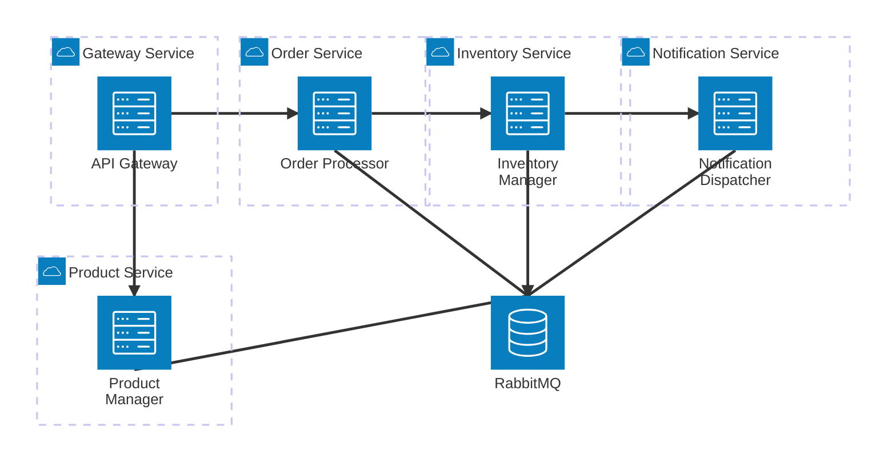

```mermaid
architecture-beta

    group gateway_service(cloud)[Gateway Service]
    service gateway_api(server)[API Gateway] in gateway_service

    group order_service(cloud)[Order Service]
    service order_processor(server)[Order Processor] in order_service

    group inventory_service(cloud)[Inventory Service]
    service inventory_manager(server)[Inventory Manager] in inventory_service

    group notification_service(cloud)[Notification Service]
    service notification_dispatcher(server)[Notification Dispatcher] in notification_service

    group product_service(cloud)[Product Service]
    service product_manager(server)[Product Manager] in product_service

    service rabbitmq(database)[RabbitMQ]

    gateway_api:R --> L:order_processor
    order_processor:R --> L:inventory_manager
    inventory_manager:R --> L:notification_dispatcher
    gateway_api:B --> T:product_manager

    order_processor:B --> T:rabbitmq
    inventory_manager:B --> T:rabbitmq
    notification_dispatcher:B --> T:rabbitmq
    product_manager:B --> T:rabbitmq
```
