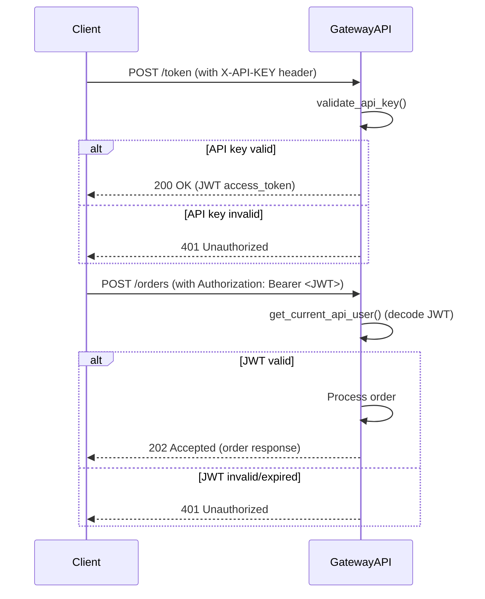

```mermaid
sequenceDiagram
    participant Client
    participant GatewayAPI

    Client->>GatewayAPI: POST /token (with X-API-KEY header)
    GatewayAPI->>GatewayAPI: validate_api_key()
    alt API key valid
        GatewayAPI-->>Client: 200 OK (JWT access_token)
    else API key invalid
        GatewayAPI-->>Client: 401 Unauthorized
    end

    Client->>GatewayAPI: POST /orders (with Authorization: Bearer <JWT>)
    GatewayAPI->>GatewayAPI: get_current_api_user() (decode JWT)
    alt JWT valid
        GatewayAPI->>GatewayAPI: Process order
        GatewayAPI-->>Client: 202 Accepted (order response)
    else JWT invalid/expired
        GatewayAPI-->>Client: 401 Unauthorized
    end
```