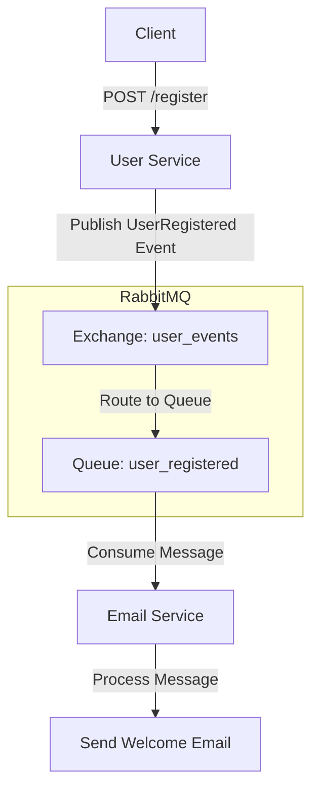

```mermaid
graph TD
    A[Client] -->|POST /register| B[User Service]
    B -->|Publish UserRegistered Event| C[RabbitMQ Exchange]
    C -->|Route to Queue| D[Queue: user_registered]
    D -->|Consume Message| E[Email Service]
    E -->|Process Message| F[Send Welcome Email]

    subgraph RabbitMQ
        C[Exchange: user_events]
        D[Queue: user_registered]
    end
```